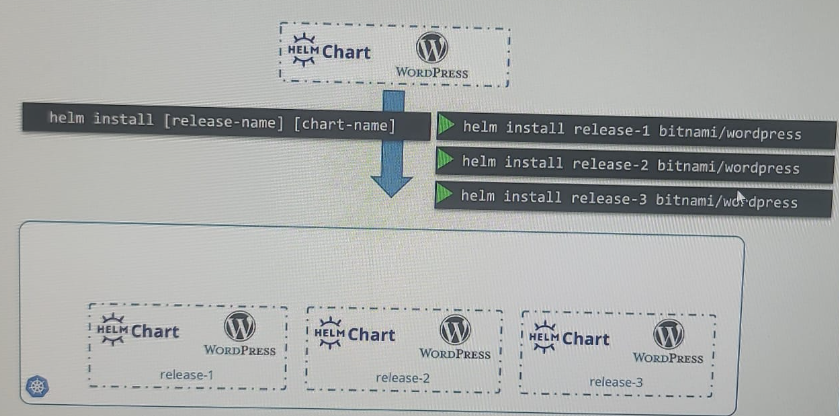

# reference
- https://chat.deepseek.com/a/chat/s/3d8b4d99-81b7-4dac-ad69-519f9bc33dea
- https://chatgpt.com/c/be9c3fd6-6caf-40c0-82c6-a7c28814284c
--- 
# HELM
- install : https://helm.sh/docs/intro/quickstart/
- install docker + kubeCTL + having Cluster running
- stores release info in configMap/Secret in same namespace where release done
  - export HELM_DRIVER=configmap
- helm install myrelease ./mychart --debug **--dry-run**
- doesn't directly call kubectl behind the scenes.  Helm has its own **Go client libraries** that communicate directly with the Kubernetes API server.
- **Smart Update Detection**
  - It compares the current state in Kubernetes with your new manifests
  - Only resources with actual changes will be updated
- **single**-release-**multiple**-revisions model
  - release-blue : revision 1, 2,....
  - release-green : revision 1, 2,....
---
## Intro
- definition:
  - `template engine` for K8s manifest yml files.
  - `package manager` for Kubernetes.
- benefit/s:
  - simplifies the process of defining, installing, and managing Kubernetes applications.
  - reuse across env and clusters.
  
## Key Components  
- chart : collections of files that describe a `related set of Kubernetes resources`.
  - `Chart.yaml`: metadata - name, version, and description.
  - `Values.yaml`: 
    - default configuration values.
    - Users can override these values based on env while installing chart.
    - values-dev,prod,etc.
  - `Templates`: 
    - A directory that contains the Kubernetes resource definitions. 
    - yml : deployment/service/configmap/PersistentVolume 
  - `Charts`: dependencies
    - directory that can contain dependent charts.
---
## commands:
- **helm repo add bitnami https://charts.bitnami.com/bitnami**
- helm repo list
   ```
    - NAME            URL                                                 
      bitnami         https://charts.bitnami.com/bitnami                  
      puppet          https://puppetlabs.github.io/puppetserver-helm-chart
      hashicorp       https://helm.releases.hashicorp.com
    ```
  
- create or pull
  - helm `create` spring-helm. 
  - helm pull --untar bitnami/wordpress
- helm `list`  
- helm `install` release-v2 spring-helm  # `uninstall`
  - -f custom-values.yaml
  - --set key1=value1,key2=value2
  - each release has name. here `release-v2`
  - `--set` image.repository=<your-ecr-repo-url>,image.tag=<tag>
- helm `upgrade` release-v2 spring-helm
  - Each upgrade creates a new revision of the same release :point_left:
- helm `delete` release-v2
- helm `history` release-v2
  - hows all revisions for release-2
- helm `rollback` release-v2 **revision-n**



---
### Scenario / JT
1. deploy in order :  pod-2(kafka) >  then, pod-3(Database) > then, pod-1(SB)
2. `issues` without helm:
- so many deployment/service manifest yml : single chart with nested child chart
- deploy them in order : chart with dependent chart.
- rollout/rollback/version them all together : rollback, history, etc
- run deployment with env specific values :


